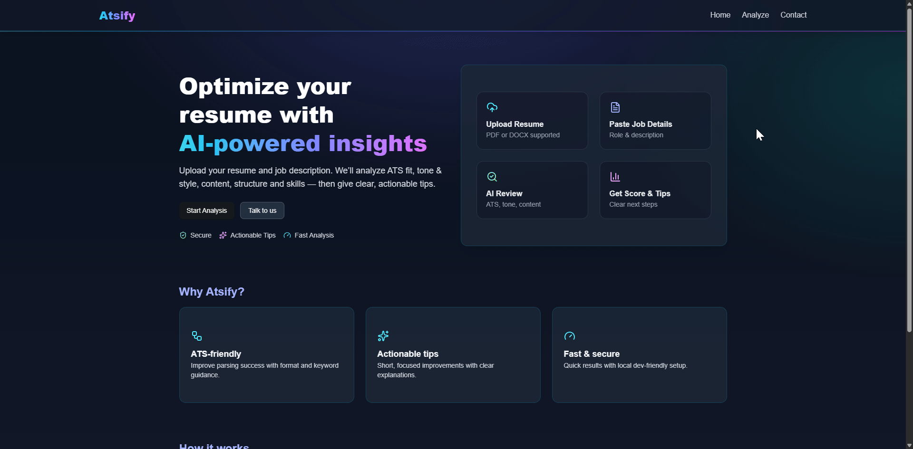
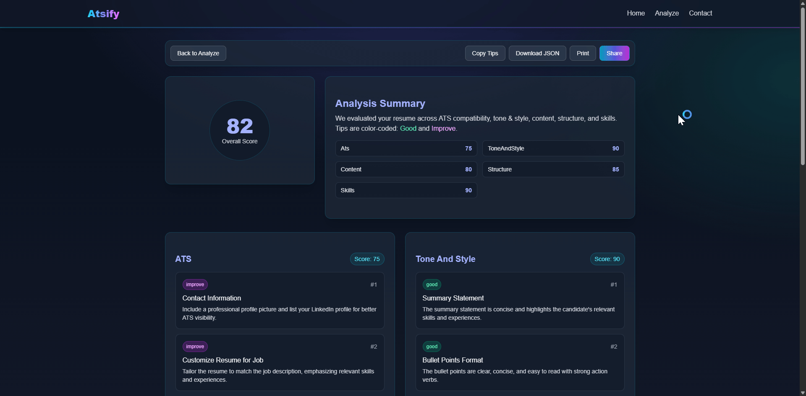
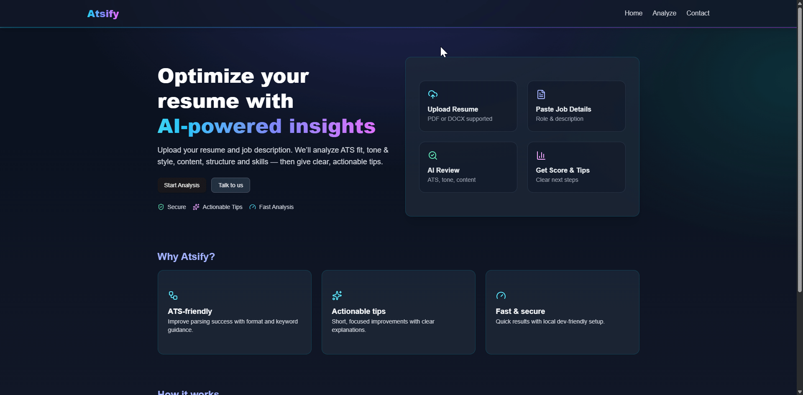

<div align="center">

# ⚡ ATSify — AI-powered Resume Analyzer

[](https://www.oracle.com/java/)
[](https://spring.io/projects/spring-boot)
[](https://spring.io/projects/spring-ai)
[](https://ollama.ai)
[](https://react.dev/)
[](https://vitejs.dev)
[](https://www.typescriptlang.org/)
[](https://tailwindcss.com/)
[](https://www.framer.com/motion/)

A tool that helps candidates tailor resumes to job descriptions using LLM analysis, with an ATS-style score and actionable tips.

</div>

---

## 🔎 Overview

ATSify parses resumes (PDF/DOCX), analyzes them against a job description using Spring AI (Ollama), and returns:

- ✅ An ATS-style score
- 💡 Strengths and gaps
- 🧰 Concrete, personalized improvement tips

> Dev-friendly emails via MailDev: HTML emails (Thymeleaf) are captured locally — no real emails sent.

---

## 🎥 Demo

- 🏠 **Landing**  
  

- 📊 **Analyze**  
  

- 📈 **Results**  
  

- 📬 **Contact (MailDev inbox)**  
  

---

## ✨ Features

- 📄 Resume parsing: PDF via Apache PDFBox, DOCX via Apache POI.
- 🤖 LLM analysis: Spring AI + Ollama (`mistral:latest` by default).
- 📬 Contact flow: Validated DTOs, async HTML email (Thymeleaf), and MailDev capture.
- 🔐 Clean separation: UI on 5173; API on 8080 with CORS.
- 🧪 Dev-first experience: No external email accounts needed.

---

## 🚀 Quickstart

Prereqs:
- Node 18+ and npm
- Java 21 and Maven
- Docker (for MailDev)
- Ollama (with mistral)

1) Start MailDev (captures emails — no real emails sent)

```bash
# From project root
docker compose up -d
# Web UI → http://localhost:1080
# SMTP   → localhost:1025
```

2) Start the API (dev profile)

```bash
cd api
mvn clean spring-boot:run -Dspring-boot.run.profiles=default
# API → http://localhost:8080
```

3) Start the UI

```bash
cd ui
npm install
npm run dev
# UI → http://localhost:5173
```

4) Use the app
- Analyze: upload resume + paste job description → score + tips.
- Contact: submit a message → check MailDev at http://localhost:1080.

---

## 📡 API Endpoints

- `POST /api/resume/analyze`
  - multipart/form-data
    - `file`: Resume file (PDF/DOCX)
    - `job`: JSON Blob `{ role: string; jobDescription: string }`
  - returns: `ResumeAnalysisResponse` (metrics, score, tips)

- `POST /api/contact`
  - JSON: `{ name: string; email: string; message: string }`
  - returns: `202 Accepted`

---

